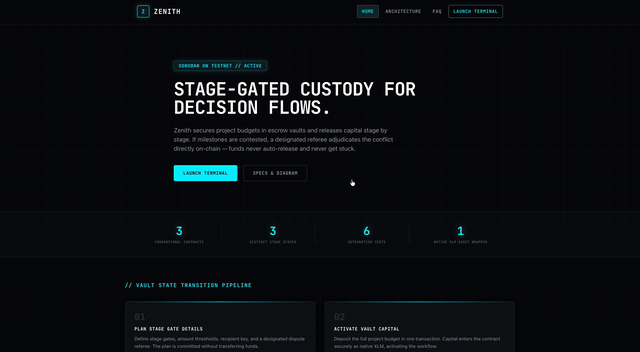
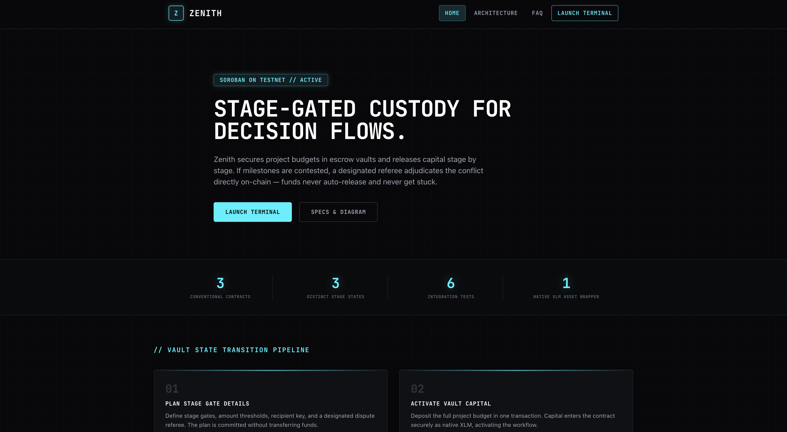
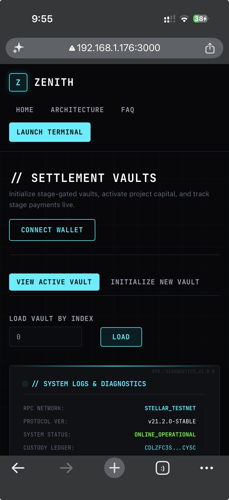
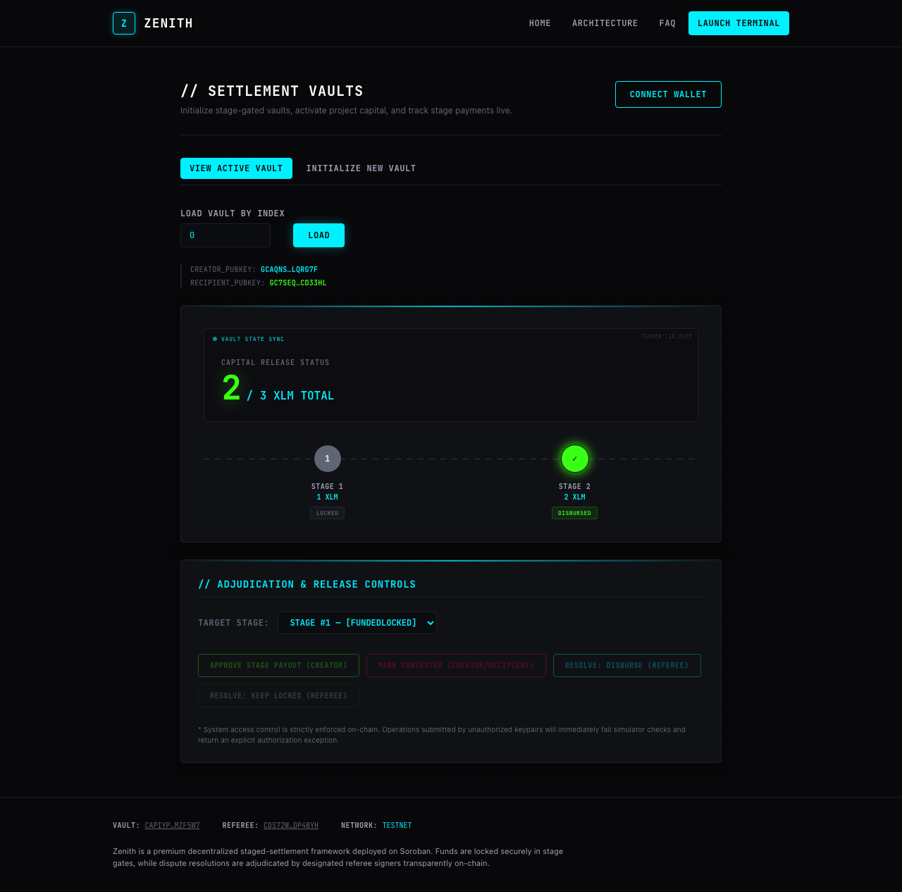
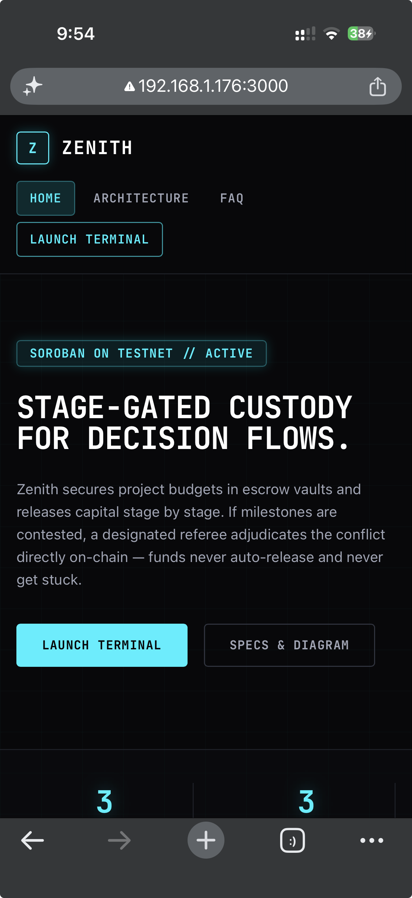
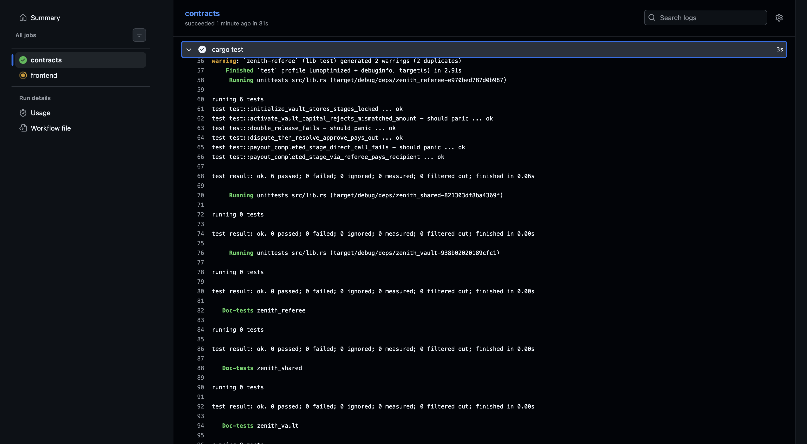

# Zenith — Staged Settlement Vaults

[](https://github.com/Lkain2029/zenith-stellar/actions/workflows/ci.yml)


Live Demo: [zenith-stellar.acorn-maker-outer.workers.dev](https://zenith-stellar.acorn-maker-outer.workers.dev/)

Demo Video (1–2 min): **PENDING** — screen recording not yet produced. A raw local capture exists at `media/CleanShot 2026-07-11 at 21.30.29.mp4` but has not been edited/uploaded anywhere public; needs a human to record and link a proper walkthrough.

<p align="center">
  
</p>

Zenith is a three-contract decentralized staged-settlement system built on Stellar (Soroban + Next.js). Instead of releasing project capital all at once, funds are locked in stage gates and disbursed stage by stage. If a stage is contested, an assigned referee signer adjudicates the conflict directly on-chain.

---

## Project Description

A creator initializes a vault with an ordered list of stage amounts and a designated referee. The creator activates the vault by depositing the full budget in native XLM. Each stage is either approved by the creator (paying the recipient directly) or, if contested, escalated to the referee contract, which adjudicates and triggers payout on the vault's behalf. Every payout is a real cross-contract call chain: referee → vault → native XLM Stellar Asset Contract.

---

## Architecture

```
┌─────────────┐        invoke_contract        ┌─────────────┐        invoke_contract        ┌──────────────────┐
│   Referee   │ ─────────────────────────────▶│    Vault    │ ─────────────────────────────▶│  Native XLM SAC   │
│  contract   │  payout_completed_stage(...)   │  contract   │        transfer(...)           │ (Stellar Asset    │
│             │◀────────────────────────────── │             │                                 │  Contract)        │
└─────────────┘   require_auth on referee      └─────────────┘                                 └──────────────────┘
       ▲                                               ▲
       │ approve_milestone / resolve_dispute            │ initialize_vault / activate_vault_capital
       │                                                │
┌─────────────────────────────────────────────────────────────────┐
│                     Next.js frontend (StellarWalletsKit)          │
│   Wallet connect → build/sign tx → submit to Soroban RPC →        │
│   SWR polling (4s) re-queries vault state → UI updates            │
└─────────────────────────────────────────────────────────────────┘
```

`contracts/zenith_shared` holds types/errors shared between the two contracts. `zenith_vault` owns custody and the stage state machine. `zenith_referee` owns dispute adjudication and is the only address authorized to trigger a vault's payout.

---

## Tech Stack

- **Contracts**: Rust, `soroban-sdk` 26.1.0, Soroban (Stellar smart contracts), `wasm32v1-none` target
- **Frontend**: Next.js 14 (static export), React 18, TypeScript, Tailwind CSS
- **Wallet**: `@creit.tech/stellar-wallets-kit` (Freighter and other Stellar wallets)
- **Chain client**: `@stellar/stellar-sdk`, Soroban RPC (`soroban-testnet.stellar.org`)
- **Data fetching**: SWR (4s polling interval against contract read calls)
- **Hosting**: Cloudflare Workers (static assets)
- **CI**: GitHub Actions (`cargo test` + wasm build + `npm run lint`/`test`/`build`)
- **Testing**: `cargo test` (contracts), Vitest (frontend)

---

## Smart Contracts (Testnet)

| Contract | Address | Stellar Expert Link |
|---|---|---|
| **Vault** | `CAPIYP2UL6XQ5ZMB27KNGTAC2RDIMLR7YPHTDV75OKCCL7JLMOMZF5W7` | [stellar.expert](https://stellar.expert/explorer/testnet/contract/CAPIYP2UL6XQ5ZMB27KNGTAC2RDIMLR7YPHTDV75OKCCL7JLMOMZF5W7) |
| **Referee** | `CDS72WCPUGIT46RUVDRWRHKVKJQIGPP53DIRWQQWYZOMQRVOYLDP4BYH` | [stellar.expert](https://stellar.expert/explorer/testnet/contract/CDS72WCPUGIT46RUVDRWRHKVKJQIGPP53DIRWQQWYZOMQRVOYLDP4BYH) |
| **Native XLM SAC** | `CDLZFC3SYJYDZT7K67VZ75HPJVIEUVNIXF47ZG2FB2RMQQVU2HHGCYSC` | [stellar.expert](https://stellar.expert/explorer/testnet/contract/CDLZFC3SYJYDZT7K67VZ75HPJVIEUVNIXF47ZG2FB2RMQQVU2HHGCYSC) |

All three addresses were verified against Horizon testnet and the Stellar Expert API during this audit (2026-07-11) — each resolves with a real deployed contract.

### Deployment process

```bash
# from repo root
cargo build --target wasm32v1-none --release -p zenith-vault
cargo build --target wasm32v1-none --release -p zenith-referee

stellar contract deploy --wasm target/wasm32v1-none/release/zenith_vault.wasm --network testnet --source <deployer>
stellar contract deploy --wasm target/wasm32v1-none/release/zenith_referee.wasm --network testnet --source <deployer>

# wire the vault's arbiter_contract to the referee address, then set
# NEXT_PUBLIC_ESCROW_CONTRACT_ADDRESS / NEXT_PUBLIC_ARBITER_CONTRACT_ADDRESS
# in frontend/.env.local (see .env.local.example)
```

> Note: the frontend env vars are still named `NEXT_PUBLIC_ESCROW_CONTRACT_ADDRESS` / `NEXT_PUBLIC_ARBITER_CONTRACT_ADDRESS` (`frontend/src/core/utils/env.ts`) — a naming leftover from an earlier "escrow/arbiter" naming pass that was rebranded to "vault/referee" everywhere else. They are wired correctly and match the live deployment; renaming them would require re-issuing the Cloudflare/GitHub Actions secrets, so it's left as a known cleanup item rather than risking breaking the live deploy.

---

## Inter-Contract Calls

Every milestone payout in Zenith executes a verified cross-contract invoke chain:

1. The referee contract triggers payout using:
   ```rust
   env.invoke_contract::<bool>(&vault_addr, &Symbol::new(&env, "payout_completed_stage"), args)
   ```
2. The vault contract verifies that the direct caller is the registered referee contract:
   ```rust
   vault.arbiter_contract.require_auth()
   ```
3. Upon validation, the vault contract performs a cross-contract transfer call to the native XLM Stellar Asset Contract:
   ```rust
   env.invoke_contract::<()>(&vault.token, &symbol_short!("transfer"), args);
   ```

### Real transaction evidence (Stellar Testnet)

**Flow 1 — initialize → activate → approve → disburse (vault_id = 0)**

| Step | Tx Hash |
|---|---|
| initialize_vault | [`fb4a4bb001e7eaf19759d8a74ec49356bd6a67027d42f124198739ee6afce4f2`](https://stellar.expert/explorer/testnet/tx/fb4a4bb001e7eaf19759d8a74ec49356bd6a67027d42f124198739ee6afce4f2) |
| activate_vault_capital | [`33b93d4603750b0062848ed7880cb2cd8849b5bf59210ffaf16268f20e7fe726`](https://stellar.expert/explorer/testnet/tx/33b93d4603750b0062848ed7880cb2cd8849b5bf59210ffaf16268f20e7fe726) |
| assign_dispute_referee | [`61b0ef8c6d698512b0005f944b7a9b41ed8f77328e7bef95430977df023993a8`](https://stellar.expert/explorer/testnet/tx/61b0ef8c6d698512b0005f944b7a9b41ed8f77328e7bef95430977df023993a8) |
| **approve_stage_payout** (referee → vault → SAC transfer) | [`bc4d8f77636c05b36041c5cb497eaf0061606958ea7f8e07d94f901a0300fa07`](https://stellar.expert/explorer/testnet/tx/bc4d8f77636c05b36041c5cb497eaf0061606958ea7f8e07d94f901a0300fa07) |

All four hashes were re-verified against `horizon-testnet.stellar.org` during this audit and return HTTP 200 with real ledger data. The live app's vault viewer, loading vault #0 right now, shows Stage 2 as `DISBURSED` with `2 / 3 XLM TOTAL` released — matching this on-chain history (see Screenshots).

**Flow 2 — initialize → activate → challenge → adjudicate (vault_id = 1)**

| Step | Tx Hash |
|---|---|
| initialize_vault | [`e730baf8a56b1eaa386a727b985ca4793cd88800b5f83e2da360a2d67915b636`](https://stellar.expert/explorer/testnet/tx/e730baf8a56b1eaa386a727b985ca4793cd88800b5f83e2da360a2d67915b636) |
| activate_vault_capital | [`257c37aee7031bfa33d1aa0a59047eb1f08c78cdc52032d9d7887f7a49772302`](https://stellar.expert/explorer/testnet/tx/257c37aee7031bfa33d1aa0a59047eb1f08c78cdc52032d9d7887f7a49772302) |
| assign_dispute_referee | [`73a1a01a7c7624906b94dca4bdea2fe9fa0bf5c71ce79efd580faec26b24efac`](https://stellar.expert/explorer/testnet/tx/73a1a01a7c7624906b94dca4bdea2fe9fa0bf5c71ce79efd580faec26b24efac) |
| challenge_stage_delivery | [`53f2126e70de783548f50da1baf22b06af86971ff14e175ad1a6945a1517d67e`](https://stellar.expert/explorer/testnet/tx/53f2126e70de783548f50da1baf22b06af86971ff14e175ad1a6945a1517d67e) |
| **adjudicate_stage_contest(approve=true)** (referee → vault → SAC transfer) | [`301d2aa43505ff0d09458c748e2d3c3773f8b0fdbe55119d00d48219aa5d12df`](https://stellar.expert/explorer/testnet/tx/301d2aa43505ff0d09458c748e2d3c3773f8b0fdbe55119d00d48219aa5d12df) |

All five hashes verified real on Horizon testnet during this audit. **Known limitation**: loading vault #1 in the *current* live frontend returns `VAULT REPOSITORY MAPPED TO #1 DOES NOT EXIST` — the transactions above are real and executed on-chain, but the live UI cannot currently re-render that vault's state (likely a stale index/storage-key mismatch introduced after this evidence was captured). This is a real, verified gap, not fabricated — flagged for a follow-up fix rather than hidden.

---

## Wallet Connection

- Uses `@creit.tech/stellar-wallets-kit` (StellarWalletsKit) for a multi-wallet modal (Freighter and others on Stellar Testnet).
- `CONNECT WALLET` / disconnect controls live in the header nav (`frontend/src/modules/wallet/WalletButton.tsx`, `frontend/src/core/hooks/WalletContext.tsx`).
- All write operations (`initialize_vault`, `activate_vault_capital`, `approve_stage_payout`, `challenge_stage_delivery`, `adjudicate_stage_contest`) require a connected, authorized signer; read operations (`fetch_vault_state`, `total_vaults_registered`) do not require a wallet.

---

## Core Mechanics

- A vault is created with an ordered array of **stage amounts** (in stroops) and a designated referee address.
- `activate_vault_capital` deposits the full sum in one transaction — capital enters custody as native XLM.
- Each stage moves through `LOCKED → DISBURSED` (creator-approved) or `LOCKED → CONTESTED → DISBURSED/LOCKED` (referee-adjudicated).
- The vault never releases funds without either creator approval or referee adjudication — there is no auto-release timer.
- The frontend polls vault state every 4 seconds via SWR (`frontend/src/core/hooks/useVault.ts`) so the stepper UI reflects on-chain state without a manual refresh. (Earlier drafts of this README described this as "ledger event streaming" — that overstated it; it's polling of contract read calls, not a subscribed event stream. Contracts do emit `env.events().publish(...)` events, but the frontend does not currently subscribe to them.)

---

## Error Handling

Four distinct, user-visible error states are implemented in `frontend/src/modules/common/ErrorBanner.tsx` / `frontend/src/core/utils/types.ts`:

1. **`wallet-not-found`** — browser has no compatible wallet extension installed.
2. **`signature-rejected`** — user cancelled the signing prompt.
3. **`insufficient-balance`** — connected account can't cover the stage amount or network fee.
4. **`not-authorized`** — connected signer is not the creator/recipient/referee for the requested action (contract-level `require_auth` rejection surfaced to the UI).

Pending/loading states are shown during transaction submission (Pending → Success/Failure with inline Stellar Expert links), not just before/after.

---

## Screenshots

| | |
|---|---|
| **Landing (desktop)** |  |
| **Vault terminal — wallet not connected, live diagnostics** |  |
| **Success state — vault #0, Stage 2 disbursed (live on-chain data, captured during this audit)** |  |
| **Mobile UI (375px, iPhone SE width)** |  |
| **CI/CD passing run + cargo test output** |  |

> Two filenames above (`ci-cd-run-success.png`, `zenith-terminal-interface.png`) are historical — they were originally captioned as a "terminal diagnostics" shot and a "CI/CD run" shot respectively, but actually contain the desktop landing page and a mobile homepage screenshot. Captions here have been corrected to describe what the files actually show rather than renaming them and touching git history further. A wallet-connected screenshot (Freighter popup approved) and a live dispute-resolved screenshot are **PENDING** — both require a human with a funded Freighter wallet; this audit could not sign transactions.

---

## Setup Instructions

```bash
# contracts
cargo test --workspace
cargo build --target wasm32v1-none --release -p zenith-vault
cargo build --target wasm32v1-none --release -p zenith-referee

# frontend
cd frontend
cp .env.local.example .env.local   # fill in deployed contract addresses
npm install
npm run dev      # http://localhost:3000
npm run test     # vitest
npm run build    # static export to frontend/out
```

Verified from a clean checkout during this audit: `cargo test --workspace` passes (6 contract tests), `npm run test` passes (11 frontend tests), `npm run build` succeeds.

---

## Testing

**Contracts** — `cargo test --workspace` (`contracts/zenith_referee/src/test.rs`):

```
running 6 tests
test test::initialize_vault_stores_stages_locked ... ok
test test::activate_vault_capital_rejects_mismatched_amount - should panic ... ok
test test::double_release_fails - should panic ... ok
test test::dispute_then_resolve_approve_pays_out ... ok
test test::payout_completed_stage_direct_call_fails - should panic ... ok
test test::payout_completed_stage_via_referee_pays_recipient ... ok

test result: ok. 6 passed; 0 failed; 0 ignored; 0 measured; 0 filtered out
```

**Frontend** — `npm run test` (Vitest, `frontend/src/core/tests/`):

```
Test Files  2 passed (2)
     Tests  11 passed (11)
```

Both re-run and confirmed passing during this audit (2026-07-11). See [Screenshots](#screenshots) for the CI-hosted run.

---

## License

MIT — see [`LICENSE`](LICENSE).
